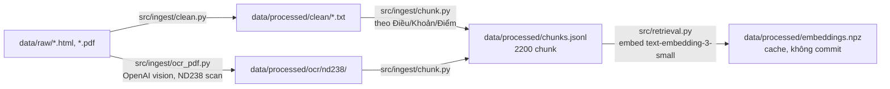
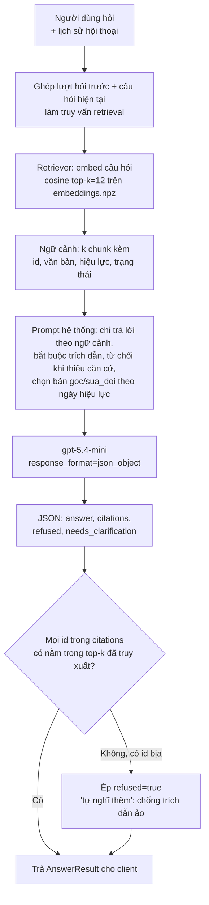
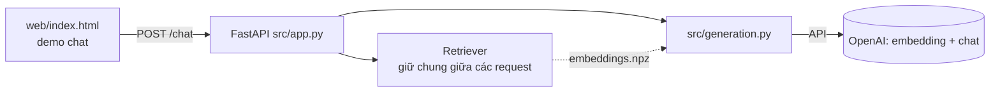

# Sơ đồ kiến trúc

## Pipeline dữ liệu (ingest, chạy 1 lần / khi nguồn đổi)

```mermaid
flowchart LR
    A[data/raw/*.html, *.pdf] -->|src/ingest/clean.py| B[data/processed/clean/*.txt]
    A -->|src/ingest/ocr_pdf.py<br/>OpenAI vision, ND238 scan| C[data/processed/ocr/nd238/]
    B -->|src/ingest/chunk.py<br/>theo Điều/Khoản/Điểm| D[data/processed/chunks.jsonl<br/>2200 chunk]
    C -->|src/ingest/chunk.py| D
    D -->|src/retrieval.py<br/>embed text-embedding-3-small| E[data/processed/embeddings.npz<br/>cache, không commit]
```

## Luồng trả lời một câu hỏi (runtime, `src/app.py` / `/chat`)

```mermaid
flowchart TD
    U[Người dùng hỏi<br/>+ lịch sử hội thoại] --> Q[Ghép lượt hỏi trước + câu hỏi hiện tại<br/>làm truy vấn retrieval]
    Q --> R[Retriever: embed câu hỏi<br/>cosine top-k=12 trên embeddings.npz]
    R --> CTX[Ngữ cảnh: k chunk kèm<br/>id, văn bản, hiệu lực, trạng thái]
    CTX --> P[Prompt hệ thống: chỉ trả lời theo ngữ cảnh,<br/>bắt buộc trích dẫn, từ chối khi thiếu căn cứ,<br/>chọn bản goc/sua_doi theo ngày hiệu lực]
    P --> L[gpt-5.4-mini<br/>response_format=json_object]
    L --> J[JSON: answer, citations,<br/>refused, needs_clarification]
    J --> V{Mọi id trong citations<br/>có nằm trong top-k đã truy xuất?}
    V -->|Không, có id bịa| F[Ép refused=true<br/>'tự nghĩ thêm': chống trích dẫn ảo]
    V -->|Có| O[Trả AnswerResult cho client]
    F --> O
```

## Thành phần triển khai

```mermaid
flowchart LR
    W[web/index.html<br/>demo chat] -->|POST /chat| S[FastAPI src/app.py]
    S --> RT[Retriever<br/>giữ chung giữa các request]
    S --> GN[src/generation.py]
    RT -.->|embeddings.npz| GN
    GN -->|API| OA[(OpenAI: embedding + chat)]
```
